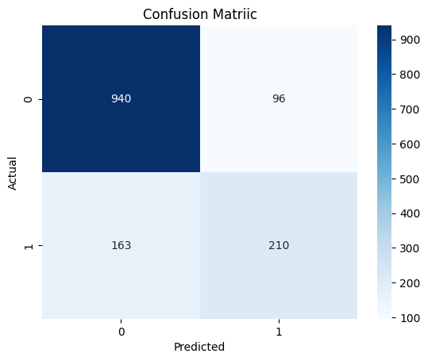

# Customer Churn Prediction – Data Cleaning & Logistic Regression

## Overview
This project demonstrates a complete machine learning workflow focused on data cleaning, preprocessing, and supervised learning. A logistic regression model is trained to predict customer churn using a real-world telecom dataset.

The goal of this project is to showcase practical machine learning skills suitable for small business and freelance tasks.

---

## Dataset
- Telco Customer Churn Dataset (public dataset)
- Data includes customer demographics, service usage, and billing information

---

## Tools & Technologies
- Python
- Pandas
- NumPy
- Scikit-learn
- Matplotlib
- Seaborn

---

## Workflow
1. Loaded and explored the dataset
2. Handled missing values and data type issues
3. Encoded categorical variables
4. Applied feature scaling
5. Split data into training and testing sets
6. Trained a Logistic Regression model
7. Evaluated performance using accuracy and confusion matrix

---

## Model Performance
- Accuracy: **81.6%**
- Evaluation Method: Train/Test Split (80/20)

### Confusion Matrix Results
- True Negatives: 940  
- False Positives: 96  
- False Negatives: 163  
- True Positives: 210  

---

## Key Takeaways
- Demonstrates clean data preprocessing and preparation
- Shows practical use of supervised machine learning
- Suitable for small ML, data cleaning, and analysis tasks

---

## How to Run
1. Clone the repository
2. Install required libraries:

pip install -r requirements.txt

3. Open the Jupyter Notebook and run all cells:

Customer_Churn_Prediction.ipynb

---

## Author
Daniyal Ali Dana

